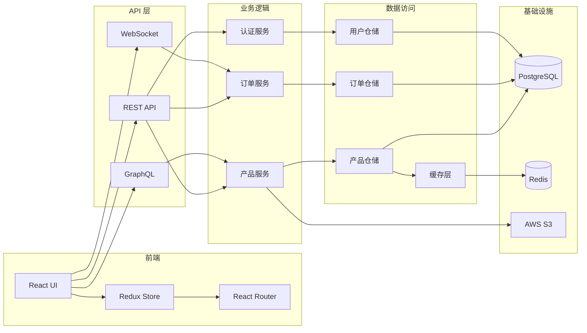

# Architecture Diagrams (架构图)

使用 Mermaid、PlantUML、C4 模型、流程图和时序图创建系统架构图。

## 概述

使用基于代码的图表工具（如 Mermaid 和 PlantUML）创建清晰、可维护的架构图，用于系统设计、数据流和技术文档。

## 何时使用

- 系统架构文档
- C4 模型图
- 数据流图
- 时序图
- 组件关系图
- 部署图
- 基础设施架构
- 微服务架构
- 数据库模式（可视化）
- 集成模式
- 嵌入式系统硬件架构
- 电路模块交互关系
- 通信协议流程
- 状态机设计

## 工具选择指南

### Mermaid

**优势**：

- GitHub/GitLab 原生支持
- 语法简洁，易于学习
- 适合快速原型
- 支持实时预览

**适用场景**：

- 系统架构图
- 流程图
- 时序图
- 甘特图
- 类图（简单场景）
- 状态图
- ER 图

**示例**：


### PlantUML

**优势**：

- 功能强大，支持复杂图表
- 适合详细的类图和组件图
- 丰富的样式选项
- 支持多种导出格式

**适用场景**：

- UML 类图
- 详细的组件图
- 部署图
- 用例图
- 活动图
- 对象图

**示例**：


### C4 模型

**优势**：

- 分层次的架构视图
- 适合大型系统
- 清晰的抽象级别
- 便于不同受众理解

**层次**：

1. **Context（上下文）**：系统与外部实体的关系
2. **Container（容器）**：系统内的高层技术构件
3. **Component（组件）**：容器内的组件
4. **Code（代码）**：类和方法（可选）

## Mermaid 详细示例

### 1. 系统架构图


### 2. 时序图


### 3. C4 上下文图


### 4. 组件图



### 5. 部署图


### 6. 数据流图


### 7. 嵌入式系统架构图


### 8. 通信协议时序图


### 9. 状态机图


## PlantUML 详细示例

### 1. 类图


### 2. 组件图

```plantuml
@startuml
package "前端" {
  [Web 应用]
  [移动应用]
}

package "API 网关" {
  [负载均衡器]
  [API 网关]
}

package "微服务" {
  [用户服务]
  [产品服务]
  [订单服务]
  [支付服务]
}

package "数据存储" {
  database "PostgreSQL" {
    [用户数据库]
    [产品数据库]
    [订单数据库]
  }
  database "Redis" {
    [缓存]
    [会话存储]
  }
}

[Web 应用] --> [负载均衡器]
[移动应用] --> [负载均衡器]
[负载均衡器] --> [API 网关]
[API 网关] --> [用户服务]
[API 网关] --> [产品服务]
[API 网关] --> [订单服务]
[API 网关] --> [支付服务]

[用户服务] --> [用户数据库]
[产品服务] --> [产品数据库]
[订单服务] --> [订单数据库]
[用户服务] --> [缓存]
[产品服务] --> [缓存]
[API 网关] --> [会话存储]
@enduml
```

### 3. 部署图


### 4. 嵌入式系统类图


## 最佳实践

### 通用原则

1. **保持简洁**

   - 每个图表只关注一个方面
   - 避免在单个图表中混合多个抽象级别
   - 使用子图对相关元素进行分组
2. **一致性**

   - 在整个项目中使用一致的符号
   - 保持命名约定的一致性
   - 使用统一的颜色方案
3. **可读性**

   - 使用清晰的标签和描述
   - 添加图例说明复杂的符号
   - 使用颜色编码传达含义
   - 确保文本大小适当
4. **可维护性**

   - 使用基于文本的格式（Mermaid、PlantUML）
   - 将图表与代码一起版本控制
   - 定期更新图表以反映代码更改
   - 添加注释说明设计决策

### 针对嵌入式系统的建议

1. **硬件架构图**

   - 清晰标注通信接口（I2C、SPI、UART等）
   - 标明电压等级和功耗信息
   - 显示关键的时序关系
   - 包含引脚分配信息
2. **通信协议图**

   - 使用时序图展示协议交互
   - 标注时间约束和延迟
   - 显示错误处理流程
   - 包含重试机制
3. **状态机设计**

   - 明确标注所有状态转换条件
   - 包含超时和错误状态
   - 标明入口和出口动作
   - 考虑所有边界情况

### ✅ 应该做的

- 使用一致的符号和记号
- 为复杂图表添加图例
- 保持图表专注于一个方面
- 有意义地使用颜色编码
- 包含标题和描述
- 对图表进行版本控制
- 使用基于文本的格式（Mermaid、PlantUML）
- 清晰显示数据流方向
- 包含部署细节
- 记录图表约定
- 使图表与代码保持同步
- 使用子图进行逻辑分组
- 标注接口和协议
- 包含错误处理路径

### ❌ 不应该做的

- 在图表中堆砌过多细节
- 使用不一致的样式
- 跳过图表图例
- 仅创建二进制图像文件
- 忘记记录关系
- 在一个图表中混合抽象级别
- 使用专有格式
- 忽略边界情况
- 省略错误处理
- 使用模糊的命名

## 常见使用场景

### 场景 1：系统设计评审

**需求**：向团队展示新系统架构

**推荐图表**：

1. C4 上下文图：展示系统与外部交互
2. C4 容器图：展示主要技术组件
3. 部署图：展示基础设施布局

### 场景 2：API 文档

**需求**：记录 API 请求流程

**推荐图表**：

1. 时序图：展示请求-响应流程
2. 数据流图：展示数据转换过程
3. 状态图：展示资源状态变化

### 场景 3：嵌入式系统开发

**需求**：设计物联网设备架构

**推荐图表**：

1. 硬件架构图：展示传感器、MCU、通信模块
2. 通信协议时序图：展示 I2C/SPI/UART 交互
3. 状态机图：展示设备运行状态
4. 数据流图：展示数据采集到上传的流程

### 场景 4：故障排查

**需求**：分析和记录系统故障

**推荐图表**：

1. 时序图：重现故障场景
2. 数据流图：识别故障点
3. 状态图：展示异常状态转换

## 工具和资源

### 在线编辑器

- **Mermaid Live Editor**: https://mermaid.live/
- **PlantUML Online**: https://www.plantuml.com/plantuml/
- **draw.io**: https://www.diagrams.net/

### VS Code 扩展

- **Mermaid Preview**: 实时预览 Mermaid 图表
- **PlantUML**: PlantUML 支持
- **Draw.io Integration**: VS Code 中的 draw.io

### 文档集成

- **Markdown**: 直接嵌入 Mermaid 代码块
- **Sphinx**: 支持 PlantUML 和 Mermaid
- **GitBook**: 原生支持 Mermaid
- **GitHub/GitLab**: 自动渲染 Mermaid

## 学习资源

- [Mermaid 官方文档](https://mermaid.js.org/)
- [PlantUML 官方文档](https://plantuml.com/)
- [C4 模型](https://c4model.com/)
- [代码即图表（Diagrams as Code）](https://diagrams.mingrammer.com/)
- [UML 教程](https://www.uml-diagrams.org/)

## 版本历史

- **v1.0.0**（2025-12-16）：初始版本
  - Mermaid 示例
  - PlantUML 示例
  - C4 模型示例
  - 嵌入式系统架构示例
  - 最佳实践指南

---

**最后更新**：2025-12-16
**Skill 类型**：Type 1（知识库）
**状态**：生产就绪
