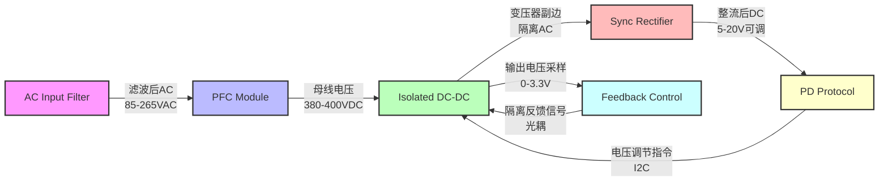

# Data Model: 功能模块与接口关系

本文档用于识别硬件规格中的关键功能模块实体，定义模块的输入输出接口、关键参数和约束条件，并绘制模块间的接口关系图。

## 如何使用本模板

1. **识别功能模块**: 基于 spec.md 中的功能需求和 plan.md 中的架构规划，拆解系统为关键功能模块（如电源模块、通信模块、传感器接口模块等）
2. **定义接口**: 为每个模块定义输入接口、输出接口、关键参数和约束条件
3. **绘制关系图**: 使用 Mermaid 或文本描述绘制模块间的接口关系，说明信号类型、电压/电流范围、通信协议等
4. **持续更新**: 在架构设计演进过程中，同步更新模块定义和接口关系

## 功能模块列表

---

### 模块 1: [待补充模块名称]

**模块名称**
<!-- 示例: "AC Input Filter Module" -->
[待补充功能模块名称]

**输入接口**
<!-- 示例: -->
<!-- - 电压范围: 85-265VAC -->
<!-- - 频率: 47-63Hz -->
<!-- - 连接器: IEC C14 -->
[待补充输入接口定义，包括电压/电流范围、信号类型、连接器规格等]

**输出接口**
<!-- 示例: -->
<!-- - 滤波后AC: 85-265VAC -->
<!-- - EMI等级: Class B (per CISPR 32) -->
<!-- - 输出阻抗: <1Ω @ 100kHz -->
[待补充输出接口定义]

**关键参数**
<!-- 示例: -->
<!-- - 共模电感: 10mH ± 20% -->
<!-- - 差模电容: 0.47µF X2 -->
<!-- - 浪涌保护: MOV 14D471K -->
<!-- - 额定电流: 1.5A RMS -->
[待补充关键参数及其规格要求]

**约束条件**
<!-- 示例: -->
<!-- - 安全标准: IEC 62368-1 -->
<!-- - 隔离要求: 基本绝缘 -->
<!-- - 环境温度: -10°C ~ +50°C -->
<!-- - 湿度: 5% ~ 95% RH 非冷凝 -->
[待补充约束条件，包括安全、可靠性、环境等要求]

---

### 模块 2: [待补充模块名称]

**模块名称**
[待补充功能模块名称]

**输入接口**
[待补充输入接口定义]

**输出接口**
[待补充输出接口定义]

**关键参数**
[待补充关键参数及其规格要求]

**约束条件**
[待补充约束条件]

---

### 模块 3: [待补充模块名称]

**模块名称**
[待补充功能模块名称]

**输入接口**
[待补充输入接口定义]

**输出接口**
[待补充输出接口定义]

**关键参数**
[待补充关键参数及其规格要求]

**约束条件**
[待补充约束条件]

---

## 模块间接口关系图

### 系统框图 (Mermaid)

<!-- 示例（65W PD充电头）:

-->

### 接口详细定义

#### 接口 1: [待补充接口名称]
<!-- 示例: "母线电压接口 (PFC → Isolated DC-DC)" -->

- **信号类型**: [待补充，如: DC电压]
- **电压范围**: [待补充，如: 380-400VDC]
- **电流范围**: [待补充，如: 0-0.2A]
- **纹波要求**: [待补充，如: <10% @ 100kHz]
- **保护机制**: [待补充，如: OVP @ 420VDC]

#### 接口 2: [待补充接口名称]

- **信号类型**: [待补充]
- **电压/电流范围**: [待补充]
- **通信协议**: [待补充，如适用]
- **时序要求**: [待补充，如适用]

#### 接口 3: [待补充接口名称]

- **信号类型**: [待补充]
- **电压/电流范围**: [待补充]
- **通信协议**: [待补充，如适用]
- **隔离要求**: [待补充，如适用]

---

## 模块实例示例

以下是一个完整的模块定义示例（以65W PD充电头的隔离DC-DC模块为例）：

### 示例: Isolated DC-DC Module

**模块名称**
Isolated DC-DC Module (隔离DC-DC模块)

**输入接口**
- 母线电压: 380-400VDC (from PFC Module)
- 功率范围: 0-65W
- 电压调节指令: I2C (from PD Protocol Module)

**输出接口**
- 输出电压: 5V/9V/12V/15V/20V 可调 (per USB PD 3.0)
- 输出电流: 最大3A (每档位)
- 纹波: <100mVpp @ 20MHz
- 动态响应: 0-100% load step, 电压偏差 <5%

**关键参数**
- 拓扑类型: AHB 或 LLC (per research.md 决策)
- 隔离耐压: 4000VAC @ 60s (per IEC 62368-1)
- 开关频率: 100-200kHz (AHB) 或 60-100kHz (LLC)
- 变压器匝比: 待细化设计
- 效率目标: >94% @ 满载, >85% @ 轻载10% (DoE Level VI)

**约束条件**
- 安全标准: IEC 62368-1
- EMC标准: CISPR 32 Class B
- 温升: 变压器表面 <80°C @ 环境温度25°C, 满载运行
- 爬电距离: 加强绝缘 ≥6.4mm (per IEC 62368-1 Table 16)
- 器件降额: 半导体器件 Vds/Vdss ≥ 1.5x, 电容耐压 ≥ 1.25x

---

## 模板使用说明

1. **模块粒度**: 功能模块应该是架构级的主要组件，不宜过细（如单个电阻电容）或过粗（如整个系统）
2. **接口完整性**: 每个模块至少定义输入和输出接口，如有内部子模块可适当展开
3. **参数可测量性**: 关键参数应该是可测量、可验证的（如电压范围、效率、温升），避免模糊描述
4. **约束可追溯性**: 约束条件应引用具体标准条款或宪法中的可靠性要求，便于后续验证
5. **持续演进**: 本文档在 Phase 0 初步建立，在详细设计阶段持续细化参数和接口定义

## 与其他文档的关系

- **spec.md**: 功能模块来源于规格中的功能需求
- **plan.md**: 架构规划中的功能框图应与本文档的模块列表和关系图一致
- **tasks.md**: 实现任务应覆盖每个模块的设计、验证和测试
- **research.md**: 模块的拓扑选择、器件选型等决策引用研究文档的结论
